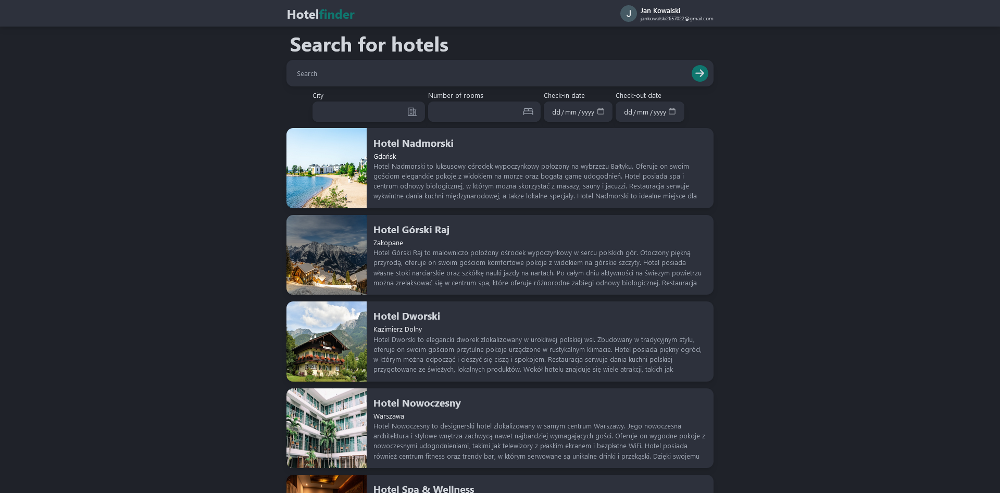
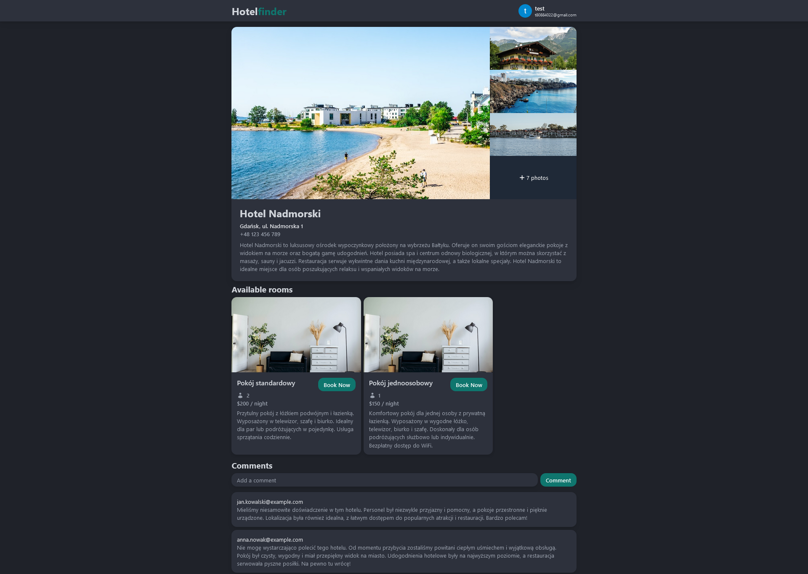
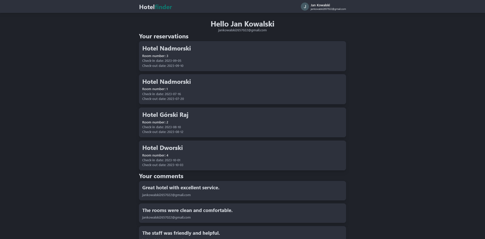

# Hotel Finder


A full-stack application built with React and ASP.NET Core Web API that allows users to reserve hotels in a given city.

## Screenshots
<div style="text-align: center;">
  
</div>

<div style="text-align: center;">
  
</div>

<div style="text-align: center;">
  
</div>

<div style="text-align: center;">
  
</div>

Images: [Unsplash](https://unsplash.com/)

Icons: [Heroicons](https://heroicons.com/) and [Google Material Icons](https://fonts.google.com/icons)

Dummy data is AI generated

## Features
- User authorization using OAuth
- Searching and browsing hotels in a specific city
- Viewing detailed hotel information
- Making hotel reservations
- Managing user profile and booking history
- Adding comments to hotels
- Pagination

## Technologies Used
### Backend
- .NET Core 7
- C#
- Entity Framework Core
- xUnit
- Moq
- Docker
- Serilog

### Frontend
- React
- TypeScript
- Tailwind CSS
- RTK Query


## Setup
### Backend
1. Open the project folder in a terminal
2. Create a `.env` file based on the provided example:
```
CONNECTION_STRING=IntegratedSecurity=true;Pooling=true;Server=db;Database=findhotel;Port=5432;User Id=postgres;Password=
PASSWORD=
AUTH0_AUTHORITY=
AUTH0_AUDIENCE=
```
3. Run `docker-compose up` to build and run the project
### Frontend
1. Open the project folder in a terminal
2. Create a `.env` file based on the provided example:
```
REACT_APP_AUTH0_DOMAIN=
REACT_APP_AUTH0_CLIENT_ID=
REACT_APP_AUTH0_AUDIENCE=http://localhost:3000
REACT_APP_AUTH0_REDIRECT_URI=http://localhost:3000
```
2. Run `npm install` to install dependencies
3. Run `npm start` to start the development server

